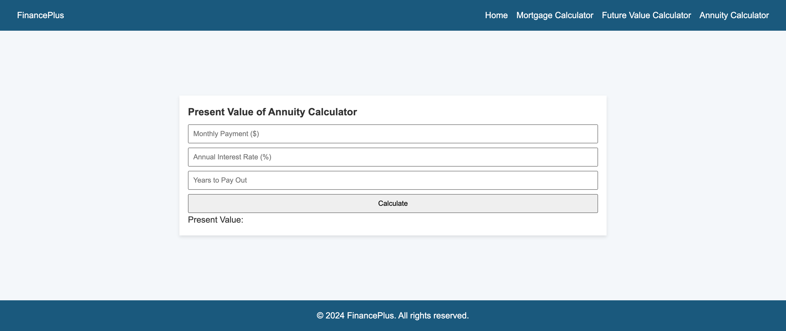
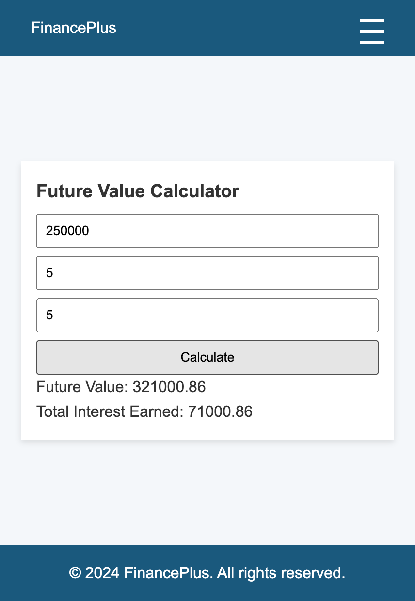
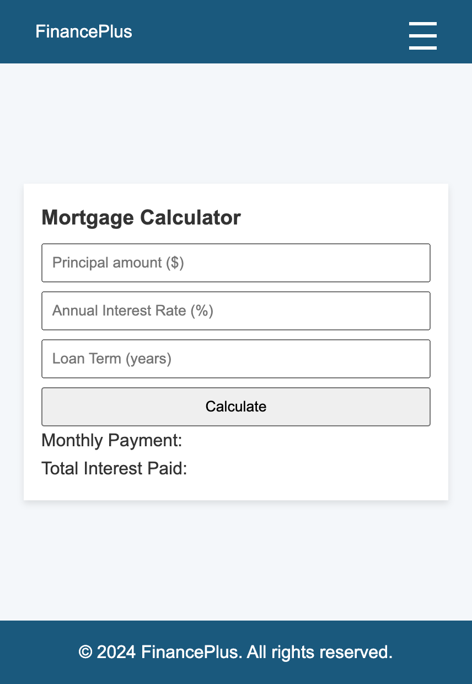

# Finance Plus

FinancePlus is a web application designed to provide users with various financial calculation tools, including a mortgage calculator, future value calculator, and annuity calculator. It features a clean, responsive design with a user-friendly interface to help users easily manage their financial planning.

## Demo

Explore the functionality of this FinancePlus platform by visiting: [FinancePlus](https://finance-plus1.netlify.app/)

## Contact

For any inquiries or issues, please open an issue on the repository or contact aaungdev@outlook.com
